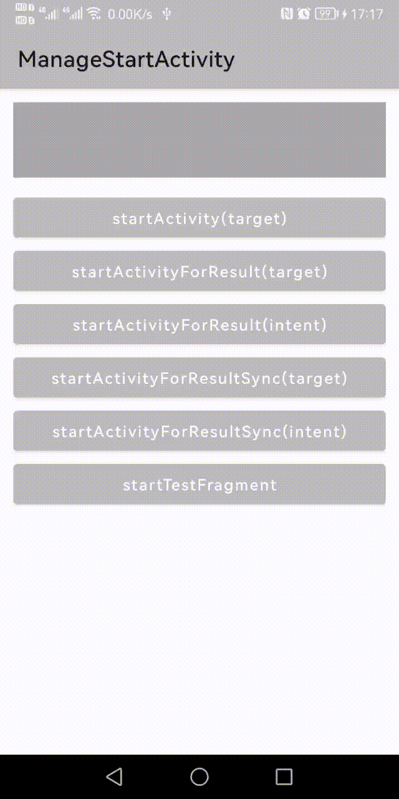
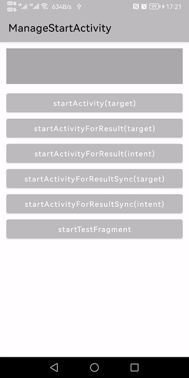
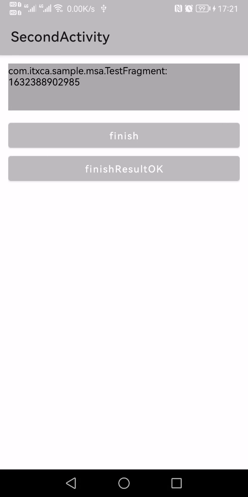
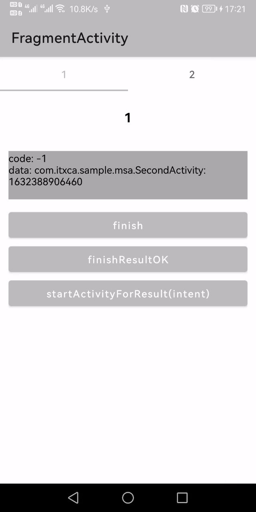

[](https://search.maven.org/artifact/com.itxca.msa/msa)
[](https://android-arsenal.com/api?level=14)
[](https://opensource.org/licenses/MIT)


## ManageStartActivity [MSA]

ActivityResultLauncher辅助类，一行代码解决~~startActivityForResult~~过时问题。

基于`registerForActivityResult`实现，满足日常使用需求。

> 由于使用到了委托，所以只支持Kotlin，Java无法使用（或者说是没有使用的意义，变成了普通的方法调用）

Android提供的`ActivityResultContracts`默认协定完整sample [ActivityResultContractsActivity](https://github.com/TxcA/ManageStartActivity/blob/master/app/src/main/java/com/itxca/sample/msa/ActivityResultContractsActivity.kt)

---
### 环境依赖

root gradle:
```groovy
allprojects {
    repositories {
        // release依赖仓库（4.1后as默认配置有）
        mavenCentral()
    }
}
```

project dependencies:
```groovy
dependencies {
    // need androidx appcompat
    implementation 'androidx.appcompat:appcompat:1.3.1'
    
    // Mange start activity
    implementation 'com.itxca.msa:msa:1.0.2'
}
```

---
### 文档

#### 扩展简写说明

可以写`IMangeStartActivity by MangeStartActivity() `, 也可以使用`IMsa by msa()`。完全一样，只是实现了一个简写。

```kotlin
// IMSA = IMangeStartActivity
typealias IMsa =  IMangeStartActivity

// msa() = MangeStartActivity()
fun msa(): MangeStartActivity = MangeStartActivity()
```

#### 推荐基于Base类，方便统一管理。

```kotlin
abstract class BaseActivity : AppCompatActivity(), IMsa by msa() {
    override fun onCreate(savedInstanceState: Bundle?) {
        // 推荐在super.onCreate 前初始化 `initMangeStartActivity`
        // 这样就能防止还未初始化`ActivityResultLauncher`就调用`launch`导致`UninitializedPropertyAccessException`异常
        initManageStartActivity()
        super.onCreate(savedInstanceState)
    }
}
```

```kotlin
abstract class BaseFragment : Fragment(), IMsa by msa()  {
    override fun onCreate(savedInstanceState: Bundle?) {
        // 推荐在super.onCreate 前初始化 `initMangeStartActivity`
        // 这样就能防止还未初始化`ActivityResultLauncher`就调用`launch`导致`UninitializedPropertyAccessException`异常
        initManageStartActivity()
        super.onCreate(savedInstanceState)
    }
}
```

#### SampleActivity

完整使用方法说明

```kotlin
// 注意实现 `IMsa by msa()`
class SampleActivity : AppCompatActivity(), IMsa by msa() {

    override fun onCreate(savedInstanceState: Bundle?) {
        // 推荐在super.onCreate 前初始化 `initMangeStartActivity`
        // 这样就能防止还未初始化`ActivityResultLauncher`就调用`launch`导致`UninitializedPropertyAccessException`异常
        initManageStartActivity()
        super.onCreate(savedInstanceState)
    }

    /**
     * 直接启动Activity
     * 3 种方式
     */
    fun startActivity() {
        // Android习惯模式，传入KClass即可
        startActivity(MainActivity::class) {
            putExtra("key", "value")
        }

        // KClass扩展方法模式
        MainActivity::class.start {
            putExtra("key", "value")
        }

        // Intent扩展方法模式
        Intent(this, MainActivity::class.java).apply {
            putExtra("key", "value")
        }.start()
    }

    /**
     * 启动Activity并需要回调结果
     * 4 种方法
     */
    fun startActivityForResult() {
        // Android习惯模式，传入KClass即可
        startActivityForResult(MainActivity::class, {
            putExtra("key", "value")
        }) { code: Int, data: Intent? ->
            // code = resultCode
        }

        // KClass扩展方法模式
        MainActivity::class.startForResult({
            putExtra("key", "value")
        }) {code: Int, data: Intent? ->
            // code = resultCode
        }

        // Android习惯模式，传入Intent即可
        startActivityForResult(Intent(this, MainActivity::class.java).apply {
            putExtra("key", "value")
        }){ code: Int, data: Intent? ->
            // code = resultCode
        }

        // Intent扩展方法模式
        Intent(this, MainActivity::class.java).apply {
            putExtra("key", "value")
        }.startForResult { code: Int, data: Intent? ->
            // code = resultCode
        }
    }

    /**
     * Kotlin协程挂起函数
     * 4 种方式
     */
    fun startActivityForResultCoroutine() {
        lifecycleScope.launch {
            // Android习惯模式，传入KClass即可
           val (code1: Int, data1: Intent?) = startActivityForResultSync(MainActivity::class) {
               putExtra("key", "value")
           }

            // KClass扩展方法模式
            val (code2: Int, data2: Intent?) = MainActivity::class.startForResultSync {
                putExtra("key", "value")
            }

            // Android习惯模式，传入Intent即可
            val (code3: Int, data3: Intent?) = startActivityForResultSync(Intent(this@SampleActivity, MainActivity::class.java).apply {
                putExtra("key", "value")
            })

            // Intent扩展方法模式
            val (code4: Int, data4: Intent?) = Intent(this@SampleActivity, MainActivity::class.java).apply {
                putExtra("key", "value")
            }.startForResultSync()
        }
    }
}
```

### 完整API
```kotlin
// startActivityForResult
fun startActivityForResult(target: KClass<out Activity>, block: Intent.() -> Unit = {}, result: StartActivityResult)
fun <T : KClass<out Activity>> T.startForResult(block: Intent.() -> Unit = {}, result: StartActivityResult)
suspend fun startActivityForResultSync(target: KClass<out Activity>, block: Intent.() -> Unit = {}): Result
suspend fun <T : KClass<out Activity>> T.startForResultSync( block: Intent.() -> Unit = {}): Result

// intent startActivityForResult
fun startActivityForResult(intent: Intent, result: StartActivityResult)
fun Intent.startForResult(result: StartActivityResult)
suspend fun startActivityForResultSync(intent: Intent): Result
suspend fun Intent.startForResultSync(): Result

// startActivity
fun startActivity(target: KClass<out Activity>, block: Intent.() -> Unit = {})
fun <T : KClass<out Activity>> T.start(block: Intent.() -> Unit = {})
fun Intent.start()
```

---
### Change
[更新历史](CHANGE.md)

---
### Screenshots




******



---
### License

```
MIT License

Copyright (c) 2021 TxcA

Permission is hereby granted, free of charge, to any person obtaining a copy
of this software and associated documentation files (the "Software"), to deal
in the Software without restriction, including without limitation the rights
to use, copy, modify, merge, publish, distribute, sublicense, and/or sell
copies of the Software, and to permit persons to whom the Software is
furnished to do so, subject to the following conditions:

The above copyright notice and this permission notice shall be included in all
copies or substantial portions of the Software.

THE SOFTWARE IS PROVIDED "AS IS", WITHOUT WARRANTY OF ANY KIND, EXPRESS OR
IMPLIED, INCLUDING BUT NOT LIMITED TO THE WARRANTIES OF MERCHANTABILITY,
FITNESS FOR A PARTICULAR PURPOSE AND NONINFRINGEMENT. IN NO EVENT SHALL THE
AUTHORS OR COPYRIGHT HOLDERS BE LIABLE FOR ANY CLAIM, DAMAGES OR OTHER
LIABILITY, WHETHER IN AN ACTION OF CONTRACT, TORT OR OTHERWISE, ARISING FROM,
OUT OF OR IN CONNECTION WITH THE SOFTWARE OR THE USE OR OTHER DEALINGS IN THE
SOFTWARE.
```